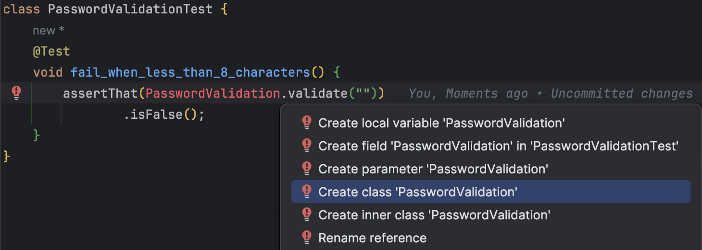
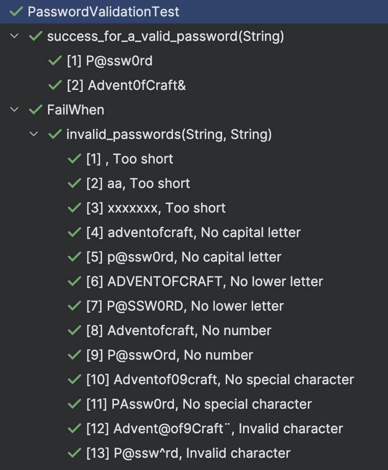
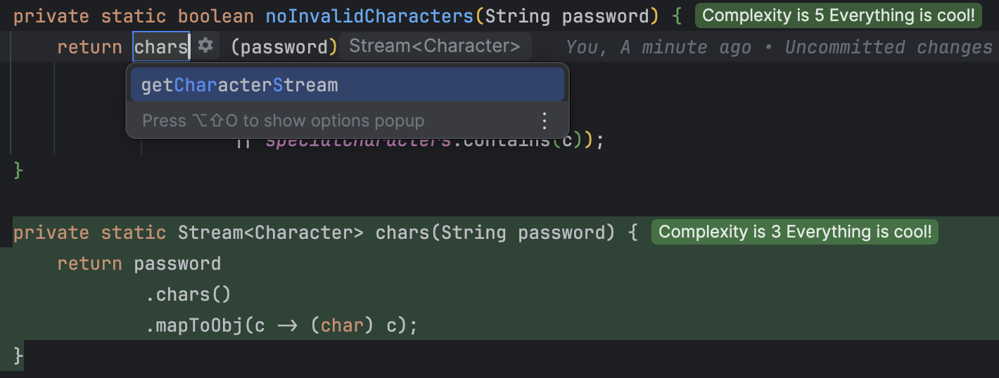
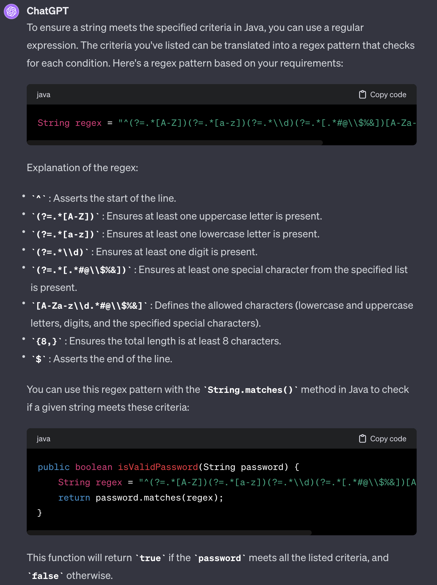

## Day 8: Using TDD rules, write a password validation program.

First step when using T.D.D, prepare a test list from the `business rules` and add examples for each.

Read this page, if you want to know more about [T.D.D](https://github.com/les-tontons-crafters/xtrem-tdd-money-kata/blob/main/docs/concepts.md).

Here are the business rules :

```text
- Contains at least 8 characters
- Contains at least one capital letter
- Contains at least one lowercase letter
- Contains at least a number
- Contains at least a special character in this list `. * # @ $ % &`.
- Any other characters are not authorized.
```

We can do it using [`Example Mapping`](https://xtrem-tdd.netlify.app/Flavours/Practices/example-mapping) workshop.

### Contains at least 8 characters

Here are some examples we can use for this business rule:

```text
- Empty string
- "a"
- "xxxxxxx" - edge case
```

🔴 Compile error

We design the method from our test. 



🟢 Then we [generate the code through our IDE](https://xtrem-tdd.netlify.app/Flavours/Design/generate-code-from-usage)

After generation, it looks like this:

```java
public class password.PasswordValidation {
    public static boolean validate(String password) {
        return false;
    }
}
```

🔵 We can move the generated class to a named package (`password`)


We tick our test list:
```text
✅ Empty string
- "aa"
- "xxxxxxx"
```

🔴🟢= 🟤 We add another `failing` test... is it failing?

```java
@Test
void fail_when_aa_because_less_than_8_characters() {
    assertThat(PasswordValidation.validate("aa"))
            .isFalse();
}
```

> Why our test is not red?

If our test is green all the way through, that is:
- Poorly designed tests
- Poorly tested behaviour
- Already supported / implemented feature


🔵 Before tackling the problem, let's refactor our tests.

```java
 @Test
void fail_when_less_than_8_characters() {
    assertThat(PasswordValidation.validate(""))
            .isFalse();
}

@Test
void fail_when_aa_because_less_than_8_characters() {
    assertThat(PasswordValidation.validate("aa"))
            .isFalse();
}
```

- We already have duplications
  - We may use `parameterized test` to avoid the duplications

```java
private static Stream<Arguments> tooShortPasswords() {
    return Stream.of(
            Arguments.of(""),
            Arguments.of("aa")
    );
}

@ParameterizedTest
@MethodSource("tooShortPasswords")
void fail_when_less_than_8_characters(String password) {
    assertThat(PasswordValidation.validate(password))
            .isFalse();
}
```

- We update our test list
  - And add the last one

```text
✅ Empty string
✅ "aa"
✅ "xxxxxxx"
```

### Add passing Unit Test
🔴 Let's add a passing test to our suite

It will become `red` at given moment and will help us to triangulate our implementation. 

```java
@Test
void success_for_a_valid_password() {
    assertThat(PasswordValidation.validate("P@ssw0rd"))
            .isTrue();
}
```

Here is our test status:


🟢 Iterate on the implementation

```java
public static boolean validate(String password) {
    if (password.length() < 8) {
        return false;
    }
    return true;
}
```

🔵 Let's clean up the production code

- Simplify `conditional` and add a private constructor (Utility class)


```java
public class PasswordValidation {
    private PasswordValidation() {
    }

    public static boolean validate(String password) {
        return password.length() >= 8;
    }
}
```

- We refactor the tests as well by splitting them into `passing` and `non-passing`
  - We create a `Nested` fail class

```java
class PasswordValidationTest {
    @Test
    void success_for_a_valid_password() {
        assertThat(PasswordValidation.validate("P@ssw0rd"))
                .isTrue();
    }

    @Nested
    class FailWhen {
        private static Stream<Arguments> tooShortPasswords() {
            return Stream.of(
                    Arguments.of(""),
                    Arguments.of("aa"),
                    Arguments.of("xxxxxxx")
            );
        }

        @ParameterizedTest
        @MethodSource("tooShortPasswords")
        void containing_less_than_8_characters(String password) {
            assertThat(PasswordValidation.validate(password))
                    .isFalse();
        }
    }
}
```

### Contains at least one capital letter

Here are some examples for this rule:
```text
- advent-of-craft
- test-driven-development
```

🔴 Add this new assumption to our tests

```java
private static Stream<Arguments> noCapitalLetters() {
    return Stream.of(
            Arguments.of("advent-of-craft")
    );
}

@MethodSource("noCapitalLetters")
@ParameterizedTest
void string_containing_less_than_8_characters(String password) {
    assertThat(PasswordValidation.validate(password))
            .isFalse();
}
```

🟢 We make it pass by checking the rule in the `String`

```java
public static boolean validate(String password) {
    return password.length() >= 8
            && password.chars().mapToObj(c -> (char) c).anyMatch(Character::isUpperCase);
}
```

🔵 We refactor the production code by extracting:
- The `8` constant
- The logic to check if the `String` contains an upper letter

```java
public static final int MINIMUM_LENGTH = 8;

public static boolean validate(String password) {
    return lengthGreaterThanMinimumLength(password)
            && containsAtLeastAnUpperCase(password);
}
```

### Fast Forward
- We iterated on the `Tests List` and have the code now looking like this:

```java
class PasswordValidationTest {
    private static Stream<Arguments> validPasswords() {
        return Stream.of(
                Arguments.of("P@ssw0rd"),
                Arguments.of("Advent0fCraft&")
        );
    }

    @MethodSource("validPasswords")
    @ParameterizedTest
    void success_for_a_valid_password(String password) {
        assertThat(PasswordValidation.validate(password))
                .isTrue();
    }

    @Nested
    class FailWhen {
        private static Stream<Arguments> tooShortPasswords() {
            return Stream.of(
                    Arguments.of(""),
                    Arguments.of("aa"),
                    Arguments.of("xxxxxxx")
            );
        }

        @MethodSource("tooShortPasswords")
        @ParameterizedTest
        void containing_less_than_8_characters(String password) {
            assertThat(PasswordValidation.validate(password))
                    .isFalse();
        }

        private static Stream<Arguments> noCapitalLetters() {
            return Stream.of(
                    Arguments.of("adventofcraft"),
                    Arguments.of("p@ssw0rd")
            );
        }

        @MethodSource("noCapitalLetters")
        @ParameterizedTest
        void containing_no_capital_letter(String password) {
            assertThat(PasswordValidation.validate(password))
                    .isFalse();
        }

        private static Stream<Arguments> noLowerLetters() {
            return Stream.of(
                    Arguments.of("ADVENTOFCRAFT"),
                    Arguments.of("P@SSW0RD")
            );
        }

        @MethodSource("noLowerLetters")
        @ParameterizedTest
        void containing_no_lower_letter(String password) {
            assertThat(PasswordValidation.validate(password))
                    .isFalse();
        }

        private static Stream<Arguments> noNumbers() {
            return Stream.of(
                    Arguments.of("Adventofcraft"),
                    Arguments.of("P@sswOrd")
            );
        }

        @MethodSource("noNumbers")
        @ParameterizedTest
        void containing_number(String password) {
            assertThat(PasswordValidation.validate(password))
                    .isFalse();
        }

        private static Stream<Arguments> noSpecialCharacters() {
            return Stream.of(
                    Arguments.of("Adventof09craft"),
                    Arguments.of("PAssw0rd")
            );
        }

        @MethodSource("noSpecialCharacters")
        @ParameterizedTest
        void containing_no_special_characters(String password) {
            assertThat(PasswordValidation.validate(password))
                    .isFalse();
        }

        private static Stream<Arguments> invalidCharacters() {
            return Stream.of(
                    Arguments.of("Advent@of9Craft¨"),
                    Arguments.of("P@ssw^rd")
            );
        }

        @MethodSource("invalidCharacters")
        @ParameterizedTest
        void containing_invalid_characters(String password) {
            assertThat(PasswordValidation.validate(password))
                    .isFalse();
        }
    }
}
```

🔵 We start by simplifying our test cases

- We keep only 1 `non-passing` parameterized test
  - We add the reason in the `parameterized test` to have more meaningful outputs

```java
class PasswordValidationTest {
    private static Stream<Arguments> validPasswords() {
        return Stream.of(
                Arguments.of("P@ssw0rd"),
                Arguments.of("Advent0fCraft&")
        );
    }

    @MethodSource("validPasswords")
    @ParameterizedTest
    void success_for_a_valid_password(String password) {
        assertThat(PasswordValidation.validate(password))
                .isTrue();
    }

    @Nested
    class FailWhen {
        private static Stream<Arguments> invalidPasswords() {
            return Stream.of(
                    Arguments.of("", "Too short"),
                    Arguments.of("aa", "Too short"),
                    Arguments.of("xxxxxxx", "Too short"),
                    Arguments.of("adventofcraft", "No capital letter"),
                    Arguments.of("p@ssw0rd", "No capital letter"),
                    Arguments.of("ADVENTOFCRAFT", "No lower letter"),
                    Arguments.of("P@SSW0RD", "No lower letter"),
                    Arguments.of("Adventofcraft", "No number"),
                    Arguments.of("P@sswOrd", "No number"),
                    Arguments.of("Adventof09craft", "No special character"),
                    Arguments.of("PAssw0rd", "No special character"),
                    Arguments.of("Advent@of9Craft¨", "Invalid character"),
                    Arguments.of("P@ssw^rd", "Invalid character")
            );
        }

        @MethodSource("invalidPasswords")
        @ParameterizedTest
        void invalid_passwords(String password, String reason) {
            assertThat(PasswordValidation.validate(password))
                    .as(reason)
                    .isFalse();
        }
    }
}
```



🔵 We can still improve the production code as well

```java
public class PasswordValidation {
    private static final int MINIMUM_LENGTH = 8;
    private static final List<Character> specialCharacters = Arrays.asList('.', '*', '#', '@', '$', '%', '&');

    public static boolean validate(String password) {
        return greaterThanMinimumLength(password)
                && atLeastOneUpperCase(password)
                && atLeastOneLowerCase(password)
                && atLeastOneNumber(password)
                && atLeastOneSpecialCharacters(password)
                && noInvalidCharacters(password);
    }

    private static boolean greaterThanMinimumLength(String password) {
        return password.length() >= MINIMUM_LENGTH;
    }

    // We may pass a list of requirements to the atLeastOne method (instead of iterating again and again)
    private static boolean atLeastOneUpperCase(String password) {
        return atLeastOne(password, Character::isUpperCase);
    }

    private static boolean atLeastOneLowerCase(String password) {
        return atLeastOne(password, Character::isLowerCase);
    }

    private static boolean atLeastOneNumber(String password) {
        return atLeastOne(password, Character::isDigit);
    }

    private static boolean atLeastOneSpecialCharacters(String password) {
        return atLeastOne(password, specialCharacters::contains);
    }

    private static boolean noInvalidCharacters(String password) {
        // This logic is duplicated
        return password
                .chars()
                .mapToObj(c -> (char) c)
                .allMatch(c -> Character.isLetter(c)
                        || Character.isDigit(c)
                        || specialCharacters.contains(c));
    }

    private static boolean atLeastOne(String password, Predicate<Character> check) {
        return password
                .chars()
                .mapToObj(c -> (char) c)
                .anyMatch(check);
    }

    private PasswordValidation() {
    }
}
```

- We start by extracting the method to get the `chars` from the `String`



- Then, our IDE automatically replace the duplication 🤩

```java
private static boolean noInvalidCharacters(String password) {
    return chars(password)
            .allMatch(c -> Character.isLetter(c)
                    || Character.isDigit(c)
                    || specialCharacters.contains(c));
}

private static boolean atLeastOne(String password, Predicate<Character> check) {
    return chars(password)
            .anyMatch(check);
}

private static Stream<Character> chars(String password) {
    return password
            .chars()
            .mapToObj(c -> (char) c);
}
```

- We can refactor the `atLeastOne` method

```java
public static boolean validate(String password) {
    return greaterThanMinimumLength(password)
            // We parameterize the atLeastOne method 
            && atLeastOne(password,
                    Character::isUpperCase,
                    Character::isLowerCase,
                    Character::isDigit,
                    specialCharacters::contains
            )
            && noInvalidCharacter(password);
}

@SafeVarargs
private static boolean atLeastOne(String password, Predicate<Character>... predicates) {
    return stream(predicates)
            // We apply each predicate on each character and verify that all predicate have been matched at least one
            .allMatch(predicate -> chars(password).anyMatch(predicate));
}
```

`Are we good for now?`

> How many times did you debug your code during this day? 🤔

### ChatGPT to improve our implementation ?
- We might use `GenAI` for this kind of stuff
  - Here is the prompt used with `ChatGPT`

```text
Show me how I can specify a regex in java from those rules:
- Contains at least 8 characters
- Contains at least one capital letter
- Contains at least one lowercase letter
- Contains at least a number
- Contains at least a special character in this list `. * # @ $ % &`.
- Any other characters are not authorized.
```



- Here is its result

```java
String regex = "^(?=.*[A-Z])(?=.*[a-z])(?=.*\\d)(?=.*[.*#@\\$%&])[A-Za-z\\d.*#@\\$%&]{8,}$";

public boolean isValidPassword(String password) {
    String regex = "^(?=.*[A-Z])(?=.*[a-z])(?=.*\\d)(?=.*[.*#@\\$%&])[A-Za-z\\d.*#@\\$%&]{8,}$";
    return password.matches(regex);
}
```

🔵 We may refactor it

```java
public static final String PASSWORD_REGEXP = "^(?=.*[A-Z])(?=.*[a-z])(?=.*\\d)(?=.*[.*#@\\$%&])[A-Za-z\\d.*#@\\$%&]{8,}$";

public static boolean validate(String password) {
    return password.matches(PASSWORD_REGEXP);
}
```

> What do you think about it? How could you maintain this code?