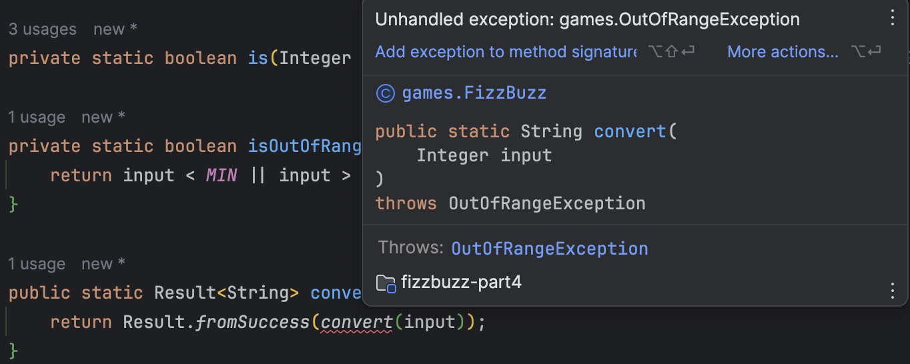

## Day 14: Do not use exceptions anymore.

`How could we avoid using exceptions?`

### Extend the output
- Our `convert` method is looking like this at the moment
  - Meaning its contract looks like this: `Integer` -> `String` (or `OutOfRangeException`)

```java
public static String convert(Integer input) throws OutOfRangeException {
    return mapping.entrySet()
            .stream()
            .filter(f -> !isOutOfRange(input))
            .filter(f -> f.getKey().test(input))
            .findFirst()
            .map(v -> v.getValue().apply(input))
            .orElseThrow(OutOfRangeException::new);
}
```

- We can use the [`Parse dont Validate`](https://xtrem-tdd.netlify.app/Flavours/parse-dont-validate) principle to redesign this method 
  - We would like that the contract looks like this: `Integer` -> `Result<Integer>` (Meaning that the result could be a failure)

> 😱 Why don't you use `Optional` in java for that? 😱 

> Thanks for your question. Not everyone uses java to solve the challenges, so we start with a `generic` implementation (that can be used no matter the languages used). 

🔴 Let's write a failing test expressing this parsing


🟢 We generate a new `convertWithResult` method from the test with the expected signature

```java
public Result<String> convertWithResult(int input) {
    return Result.fromSuccess(convert(input));
}
```

- We generate the `Result` class as well to end up with

```java
public class Result<T> {
    private final T success;

    public Result(T success) {
        this.success = success;
    }

    public static <T> Result<T> fromSuccess(T success) {
        return new Result<>(success);
    }

    public T success() {
        return success;
    }
}
```

- The `convert` method is not safe
  

- We need to adapt it
  - We reintroduce an `if` temporary 😬

```java
public static String convert(Integer input) throws OutOfRangeException {
    if (isOutOfRange(input)) {
        throw new OutOfRangeException();
    }
    return convertSafely(input);
}

public static Result<String> convertWithResult(int input) {
    return Result.fromSuccess(convertSafely(input));
}

private static String convertSafely(Integer input) {
    return mapping.entrySet()
            .stream()
            .filter(f -> f.getKey().test(input))
            .findFirst()
            .map(v -> v.getValue().apply(input))
            // If no entry -> return toString()
            .orElse(input.toString());
}
```

🔵 What can be improved?

- We can remove the `DEFAULT` map entry

🔴 We write another test

```java
@ParameterizedTest
@MethodSource("invalidInputs")
void parse_fail_for_numbers_out_of_range(int input) {
    assertThat(FizzBuzz.convertWithResult(input).failed())
            .isTrue();
}
```

🟢 We iterate on `convertWithResult` implementation to handle failure

```java
public static Result<String> convertWithResult(int input) {
    return isOutOfRange(input)
            ? Result.failure()
            : Result.fromSuccess(convertSafely(input));
}
```

- We adapt the `Result` class to support failure

```java
public class Result<T> {
    private T success;

    public Result(T success) {
        this.success = success;
    }

    public Result() {
    }

    public static <T> Result<T> fromSuccess(T success) {
        return new Result<>(success);
    }

    public static <T> Result<T> failure() {
        return new Result<>();
    }

    public T success() {
        return success;
    }

    public boolean failed() {
        return success == null;
    }
}
```

🔵 We delete the previous `convert` implementation and rename the `convertWithResult` method


- We can now delete the `OutOfRangeException` as well
- We can simplify our `mapping` logic

```java
private static final Map<Predicate<Integer>, Function<Integer, String>> mapping;

static {
    mapping = new LinkedHashMap<>();
    // We can store only `Integer` -> `String`
    mapping.put(i -> is(FIZZBUZZ, i), i -> "FizzBuzz");
    mapping.put(i -> is(FIZZ, i), i -> "Fizz");
    mapping.put(i -> is(BUZZ, i), i -> "Buzz");
}
```

- Let's do it:

```java
private static final Map<Integer, String> mapping;

static {
    mapping = new LinkedHashMap<>();
    mapping.put(FIZZBUZZ, "FizzBuzz");
    mapping.put(FIZZ, "Fizz");
    mapping.put(BUZZ, "Buzz");
}

private static String convertSafely(Integer input) {
    return mapping.entrySet()
            .stream()
            .filter(f -> is(f.getKey(), input))
            .findFirst()
            .map(Map.Entry::getValue)
            .orElse(input.toString());
}
```

#### Use an existing Result
Alternatively, we can use an existing data structure to represent the `Result` of the parsing method.
Let's use `vavr` to do so.

```xml
<properties>
    <vavr.version>0.10.4</vavr.version>
    <vavr-test.version>0.4.3</vavr-test.version>
</properties>

<dependencies>
    <dependency>
        <groupId>io.vavr</groupId>
        <artifactId>vavr</artifactId>
        <version>${vavr.version}</version>
    </dependency>
    <!-- To facilitate assertions -->
    <dependency>
        <groupId>org.assertj</groupId>
        <artifactId>assertj-vavr</artifactId>
        <version>${vavr-test.version}</version>
        <scope>test</scope>
    </dependency>
</dependencies>
```

The equivalent of our `Result` class is the [`Option`](https://docs.vavr.io/#_option) monadic container.
  - Immutable structure
  - Functor

🔴 We adjust the tests to use the `Option`

```java
@ParameterizedTest
@MethodSource("validInputs")
void parse_successfully_numbers_between_1_and_100(int input, String expectedResult) {
    assertThat(FizzBuzz.convert(input))
            .isEqualTo(Some(expectedResult));
}

@ParameterizedTest
@MethodSource("invalidInputs")
void parse_fail_for_numbers_out_of_range(int input) {
    assertThat(FizzBuzz.convert(input).isEmpty())
            .isTrue();
}
```

🟢 We adapt the `convert` method

```java
public static Option<String> convert(int input) {
    return isOutOfRange(input)
            ? Option.none()
            : Option.some(convertSafely(input));
}
```

🔵 Anything to improve / refactor?

- We can use `vavr` map to simplify our implementation

```java
public class FizzBuzz {
    private static final int MIN = 1;
    private static final int MAX = 100;

    private static final Map<Integer, String> mapping = LinkedHashMap.of(
            15, "FizzBuzz",
            3, "Fizz",
            5, "Buzz"
    );

    public static Option<String> convert(int input) {
        return isOutOfRange(input)
                ? none()
                : some(convertSafely(input));
    }

    private static String convertSafely(Integer input) {
        return mapping
                .find(p -> is(p._1, input))
                .map(p -> p._2)
                .getOrElse(input.toString());
    }

    private static boolean is(Integer divisor, Integer input) {
        return input % divisor == 0;
    }

    private static boolean isOutOfRange(Integer input) {
        return input < MIN || input > MAX;
    }
}
```

- What do you think about those concepts and this library?
- What could you do with it?