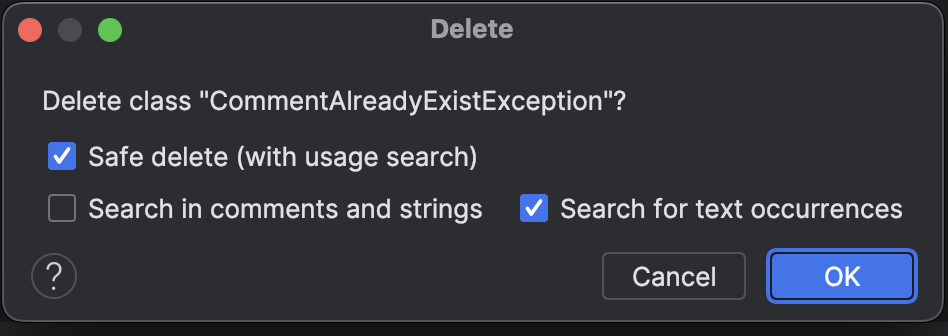

## Day 19: No more exception authorized - use a custom Error.

> Why would we like to avoid Exceptions?

### Exceptions vs Errors

> "Exception handling is the process of responding to the occurrence of exceptions – anomalous or exceptional conditions requiring special processing – during the execution of a program." - Wikipedia

Exceptions and errors are not the same thing:
- Exceptions: exceptional situations, which by definition can not be many
  - Should not leave the system boundaries in their original form
  - If the thrown exception is processed by our application, `should we really use an exception mechanism?` 
- Error/Result explicitly declares the possibility of an error and allows `linear` processing

### Use an explicit Error instead of Exception
Once again we need to adapt our `Article` class.

The problem if we use an `Error` here is that we need to be able to express that the method `addComment` can return:
- an `Article` in case of `success`
- an `Error` in case of `failure`

The good news is that we can do it really easily by using existing mechanism: monadic container `Either<L, R>`. It is already defined in [`vavr`](https://docs.vavr.io/#_either).

More explanations on this concept [here](https://xtrem-tdd.netlify.app/Flavours/Design/monads).

🔴 We start by describing our new expectation from a test
- We design a new method `addCommentWithoutException`
  - That will return `Either<blog.Error, Article>`
  - By convention the `left` case is the `failure` one

```java
@Test
void should_add_comment_in_an_article_without_exception() {
    Either<blog.Error, Article> result = anArticle().build().addCommentWithoutException(COMMENT_TEXT, AUTHOR);

    assertThat(result.isRight()).isTrue();
    assertComment(result.get().getComments().get(0), COMMENT_TEXT, AUTHOR);
}
```

- We use this a test as a driver for our refactoring


- We generate the code from here


- We have a skeleton like this
  - We are now able to compile

```java
public record Error(String message) {
}

public Either<Error, Article> addCommentWithoutException(String text, String author) {
    return null;
}
```

🟢 Make it green by simply returning what is expected from our assumption (hypothesis / test)

```java
public Either<Error, Article> addCommentWithoutException(String text, String author) {
    return Either.right(addComment(text, author));
}
```

🔵 Anything to refactor?
- We can refactor the other `passing` test and the `DSL`

```java
class ArticleTests {
    private Either<Error, Article> result;

    @Test
    void should_add_comment_in_an_article() {
        when(article -> article.addCommentWithoutException(COMMENT_TEXT, AUTHOR));
        then(result -> {
            assertThat(result.isRight()).isTrue();
            assertComment(result.get().getComments().get(0), COMMENT_TEXT, AUTHOR);
        });
    }

    @Test
    void should_add_comment_in_an_article_containing_already_a_comment() {
        final var newComment = create(String.class);
        final var newAuthor = create(String.class);

        when(ArticleBuilder::commented, article -> article.addCommentWithoutException(newComment, newAuthor));
        then(result -> {
            assertThat(result.isRight()).isTrue();
            var article = result.get();

            assertThat(article.getComments()).hasSize(2);
            assertComment(article.getComments().last(), newComment, newAuthor);
        });
    }

    private static void assertComment(Comment comment, String commentText, String author) {
        assertThat(comment.text()).isEqualTo(commentText);
        assertThat(comment.author()).isEqualTo(author);
    }

    private void when(ArticleBuilder articleBuilder, Function<Article, Either<Error, Article>> act) throws CommentAlreadyExistException {
        result = act.apply(
                articleBuilder.build()
        );
    }

    private void when(Function<Article, Either<Error, Article>> act) {
        when(anArticle(), act);
    }

    private void when(Function<ArticleBuilder, ArticleBuilder> options, Function<Article, Either<Error, Article>> act) {
        when(options.apply(anArticle()), act);
    }

    private void then(Consumer<Either<Error, Article>> act) {
        act.accept(result);
    }
  ...
}
```


🔴 Let's use this new method from the `non passing` test
- We will triangulate the remaining of the implementation like this

```java
@Test
void when__adding_an_existing_comment() {
    when(ArticleBuilder::commented, article -> article.addCommentWithoutException(article.getComments().get(0).text(), article.getComments().get(0).author()));
    then(result -> {
        assertThat(result.isLeft()).isTrue();
        assertThat(result.getLeft()).isEqualTo(new Error("This comment already exists in this article"));
    });
}
```

- It is failing because we still throw the `CommentAlreadyExistException` exception


🟢 Let's implement the missing check in `Article`

```java
public Either<Error, Article> addCommentWithoutException(String text, String author) {
    var comment = new Comment(text, author, LocalDate.now());

    return comments.contains(comment)
            ? left(new Error("This comment already exists in this article"))
            : right(new Article(name, content, comments.append(comment)));
}
```

🔵 There is plenty of improvement opportunity

- Adapt the Builder to use the new method

```java
public class ArticleBuilder {
    public static final String AUTHOR = "Pablo Escobar";
    public static final String COMMENT_TEXT = "Amazing article !!!";
    private Map<String, String> comments;

    public ArticleBuilder() {
        comments = HashMap.empty();
    }

    public static ArticleBuilder anArticle() {
        return new ArticleBuilder();
    }

    public ArticleBuilder commented() {
        this.comments = comments.put(COMMENT_TEXT, AUTHOR);
        return this;
    }

    public Article build() {
        var article = new Article(
                create(String.class),
                create(String.class)
        );
        return comments.foldLeft(article, (a, c) -> a.addCommentWithoutException(c._1, c._2).get());
    }
}
```

- Delete the exception



- Our IDE detects some usages that we need to clean 🥳


- We can now delete the previous `addComment` (no more caller)


- We rename `addCommentWithoutException` to `addComment` and end up with

```java
public class Article {
    private final String name;
    private final String content;
    private final Seq<Comment> comments;

    public Article(String name, String content) {
        this(name, content, of());
    }

    private Article(String name, String content, Seq<Comment> comments) {
        this.name = name;
        this.content = content;
        this.comments = comments;
    }

    public Either<Error, Article> addComment(String text, String author) {
        var comment = new Comment(text, author, LocalDate.now());

        return comments.contains(comment)
                ? left(new Error("This comment already exists in this article"))
                : right(new Article(name, content, comments.append(comment)));
    }

    public Seq<Comment> getComments() {
        return comments;
    }
}
```

- Regarding the tests, we can simplify assertions by using [`assertj-vavr`](https://github.com/assertj/assertj-vavr)

```xml
<dependency>
    <groupId>org.assertj</groupId>
    <artifactId>assertj-vavr</artifactId>
    <version>${assertj-vavr.version}</version>
    <scope>test</scope>
</dependency>
```

- It simplifies assertions of monadic containers

```java
@Test
void should_add_comment_in_an_article() {
    when(article -> article.addComment(COMMENT_TEXT, AUTHOR));
    then(result -> VavrAssertions.assertThat(result).hasRightValueSatisfying(article -> {
        assertComment(article.getComments().last(), COMMENT_TEXT, AUTHOR);
    }));
}

@Test
void should_add_comment_in_an_article_containing_already_a_comment() {
    final var newComment = create(String.class);
    final var newAuthor = create(String.class);

    when(ArticleBuilder::commented, article -> article.addComment(newComment, newAuthor));
    then(result -> VavrAssertions.assertThat(result).hasRightValueSatisfying(article -> {
        assertThat(article.getComments()).hasSize(2);
        assertComment(article.getComments().last(), newComment, newAuthor);
    }));
}

@Nested
class Fail {
    @Test
    void when_adding_an_existing_comment() {
        when(ArticleBuilder::commented, article -> article.addComment(article.getComments().get(0).text(), article.getComments().get(0).author()));
        then(result -> VavrAssertions.assertThat(result)
                .containsOnLeft(new Error("This comment already exists in this article")))
        ;
    }
}
```