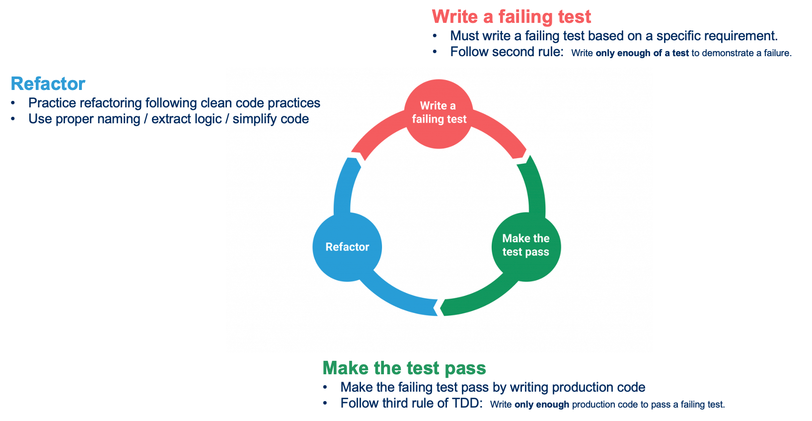
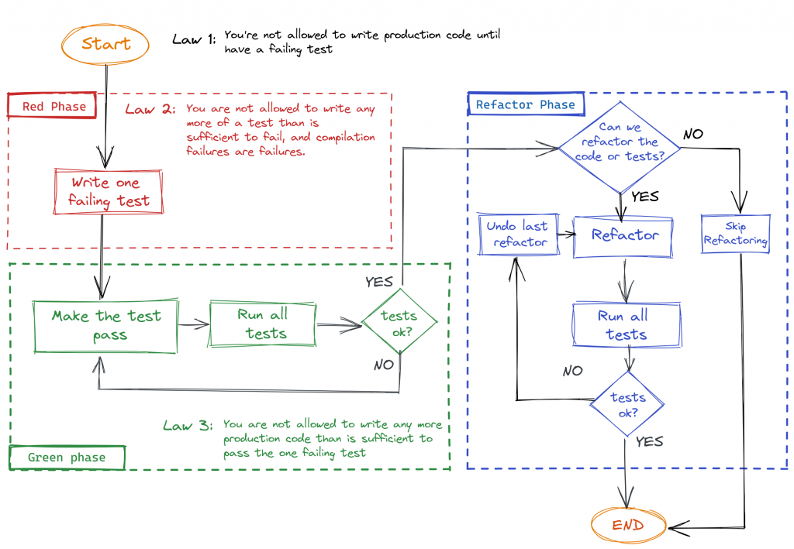

# T.D.D
## Before we start
- Think of 3 benefits regarding writing tests before production code
- Think about disadvantages as well

## What is Test-Driven Development (TDD)
TDD is a technique born of a set of beliefs about code :

* Simplicity - the art of maximizing the amount of work *not* done
* Obviousness and clarity are more virtuous than cleverness
* Writing uncluttered code is a key component of being successful

It's a methodology from Extreme Programming (XP) which was developed by Kent Beck while working on the C3 project.

> Test-Driven Development is a way of managing fear during programming - Kent Beck

### Designing and structuring code
Test-Driven Development is **not** about testing code.
Tests are a mean to an end, our **safety net**, not the objective.

It is about

- Improving the design / structure of the code
- Allowing us to **safely** refactor thanks to our tests

### A bias toward simplicity
There are multiple ways to measure simplicity in Software :

- Fewer lines of code per feature
- Lower Cyclomatic Complexity
- Fewer side effects
- Smaller runtime / memory requirements

TDD forces us to craft the simplest thing that works

- Don't write more code than necessary (**YAGNI**)
- Stop the temptation to introduce artificial complexity

Still, TDD isn't a magic wand. It won't reduce:

- your development time
- the lines of code
- defect count

### Increased Confidence
TDD increases our confidence in our code :

- Each new test flexes the system in new, and previously untested, ways
- Over time, the tests suite guards us against regression failures
- We constantly have a fast feedback on the system's state (fast feedback-loop)

### Building blocks of TDD

* TDD is a scientific approach to Software Development
    * Write an hypothesis
    * Run the experiment
    * Observe the outcome
    * Try something new
    * Run the experiment
    * Observe the outcome
    * Try something new  
    * etc...

A 3-phase process :

- 🔴 ***Red*** : We write a failing test
    * Including possible compilation failures
    * We run the test suite to verify the failing test
- 🟢 ***Green*** : We write **just enough production code** to make the test green
    * Become the dirty developer for a minute
      * Hardcode
      * Duplicate
      * Copy/Paste
    * This step needs to be fast
    * We run the test suite to verify this
- 🔵 ***Refactor*** : We remove any code smells
    * Duplication, hardcoded values, improper use of language idioms, ...
    * If we break any test during this phase :
        * Prioritize getting back to green before exiting this phase
        * The longer it takes to come back to a safe state, the harder it is
        * Avoid sunk cost fallacy

### 3 Rules from Uncle Bob
1. Write production code only to pass a failing unit test.
1. Write no more of a unit test than sufficient to fail (compilation failures are failures).
1. Write no more production code than necessary to pass the one failing unit test.

### Canon T.D.D

## FizzBuzz
Kata to practice T.D.D

Write a function that returns for a given number from 1 to 100 this given number, except that : 

- For multiples of 3 returns “Fizz”
- For the multiples of 5 returns “Buzz”
- For numbers which are multiples of both 3 and 5 returns “FizzBuzz”

### Example Mapping

Example:

### A little bit too easy?
* Remove “if” in your code
* Parameterize your FizzBuzz, implement this method : 
   * int limit : 100
   * int fizz : 3
   * int buzz : 5
* Extend your program
   * Multiples of 7 are “Whizz”
   * Multiples of 11 are “Bang”
* Create a Higher Order Function (fizzBuzz function takes an action function in args)
* Add a voice output
* Write it in an unknown language (still by using TDD)
* ...

## Reflect
- What happened to your code when implementing new tests?
- How many time did you spent debugging your code?
